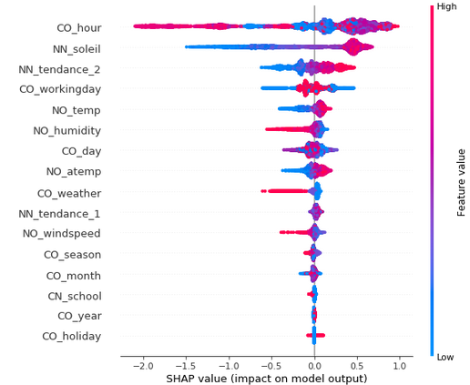
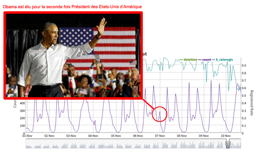

# Objectif

Les différentes étapes de notre participation au Kaggle Bike Sharing : https://www.kaggle.com/c/bike-sharing-demand/. Il s'agit de prédire le nombre de vélos loués dans la ville Washington, DC à différentes heures de la journée sur une période allant du 1er janvier 2011 au 31 Décembre 2012. Les variables à disposition permettant de modéliser la variable d'intérêt sont l'heure, le jour de la semaine, le mois de l'année, la température, etc.

# Résultats, top 4%
Finalement, notre modèle XGBoost nous a permis d'atteindre une RMLSE de 0.38334, ce qui nous classe dans le top 4% du Public LeaderBoard. En plus de ce bon résultat, nous nous sommes intéressés à l'interprétation du modèle grâce à la librairie `shap`. Ci-dessous le graphique résumant l'importance des variables. On peut remarquer que parmi les variables les plus importantes, se trouve l'élévation du soleil, variable issue de notre propre features engineering.




# Organisation du projet

Le projet est organisé en 4 sous projets :
 1. **Importation des données** : Ajout des variables temporelles basiques avec la librairie Pandas de Python (heure, jour de la semaine, mois, année)
 2. **Cleaning et Features engineering** : Création des variables tendances temporelles, élévation du soleil, congés, vacances scolaires avec R
 3. **Exploration** :  Application Shiny permettant de croiser n'importe quelle feature (et paire de features) avec la variable cible avec R
 4. **Modélisation** :  Régression Ridge, Random Forest et Extreme Gradient Boosting avec Scikit-Learn et xgboost de Python

# Environnement Conda
Afin de répliquer l'environnement utilisé, lancez l'action suivante 

```
conda env create -f environment.yml
```

# Remarques 

Cependant, la variable d'intérêt dépend également d'autres facteurs comme les événements majeurs de la vie sportive et politique américaine comme on peut le voir dans les exemples ci-dessous :

#### Pic *anormal* de location de vélos lors de la seconde élection d'Obama le 6 Novembre 2012


#### Pic *anormal* de location de vélos lors du Super Bowl XLVI le 5 Février 2012


# Auteurs

 * Serge Nakache : https://www.linkedin.com/in/serge-nakache-1b5364ab/
 * Vincent Gigliobianco : https://www.linkedin.com/in/vincent-gigliobianco-4b45a9a8/
 
