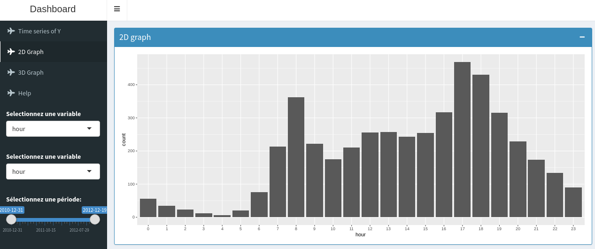
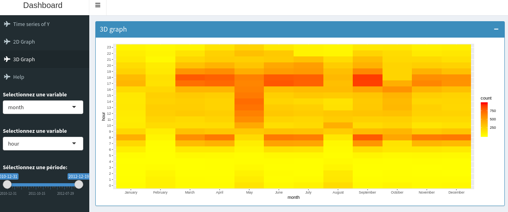
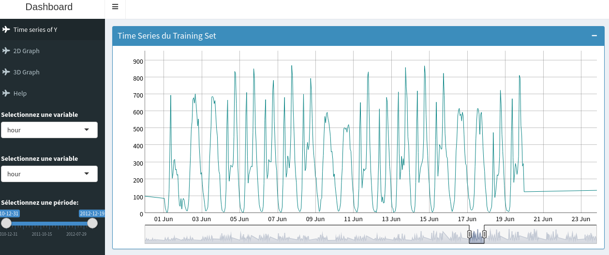

# Objectif

L'objectif de ce folder est le développement d'une application Shiny permettant d'explorer les données du dataset Bike Sharing dans le but de créer des features pertinentes (p02).

## Variable Versus Target (2d plot)
L'utilisateur peut explorer le lien qui existe entre n'importe quelle variable et la variable cible (nombre de vélos loués).

## Variable x Variable Versus Target (3d plot)
L'utilisateur peut explorer le lien qui existe entre le croisement de n'importe quelle paire de variables présentes dans le dataset et la variable cible (nombre de vélos loués).

## Time Series
L'utilisateur peut explorer tout les points de la time serie représentant le nombre de vélos loués par heure entre le 1er Janvier 2011 et le 31 Décembre 2012.

## Prérequis: avoir fait
install.packages("ggplot2")
install.packages("lubridate")
install.packages(("dplyr"))
install.packages("dygraphs")
install.packages("shinydashboard")
install.packages("markdown")